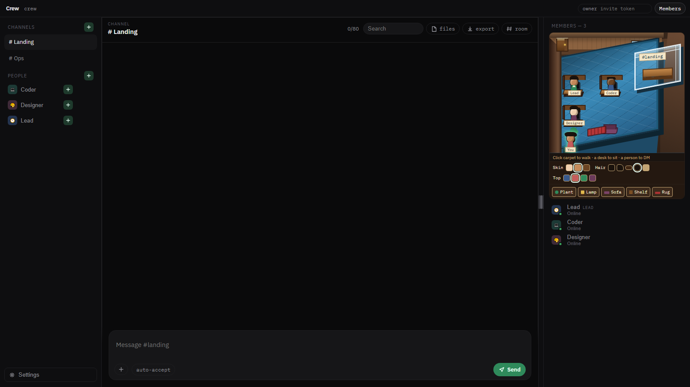
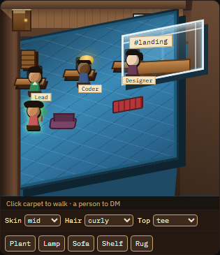
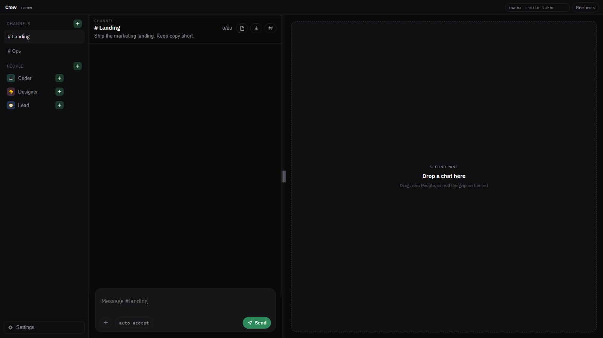
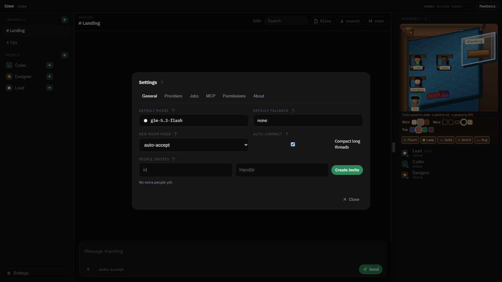
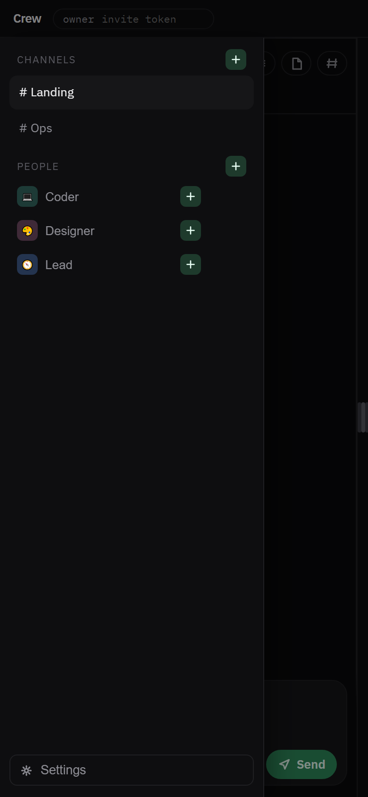

# Crew

Local multi-bot **office**. You own the channels and the people. `@coder` wakes that person; everyone else waits. They work at their desk (tools + thinking), then **give an account** in the channel. If they need you, they stop. They may DM. You can read every DM.

Loopback only. Not a Discord.js bot, not Electron, not a cloud VM.

Vibecoded with Grok 4.6.

## Download (Windows)

| | |
|---|---|
| **Installer** | [Crew_0.12.0_x64-setup.exe](https://github.com/ArdaDDemir/crew/releases/download/v0.12.0/Crew_0.12.0_x64-setup.exe) |
| MSI | [Crew_0.12.0_x64_en-US.msi](https://github.com/ArdaDDemir/crew/releases/download/v0.12.0/Crew_0.12.0_x64_en-US.msi) |
| Portable zip | [Crew-0.12.0-windows-portable.zip](https://github.com/ArdaDDemir/crew/releases/download/v0.12.0/Crew-0.12.0-windows-portable.zip) |

All files: [github.com/ArdaDDemir/crew/releases/tag/v0.12.0](https://github.com/ArdaDDemir/crew/releases/tag/v0.12.0)

WebView2 is Windows 11 / current Edge. Open a project folder. Settings → Providers: [OpenRouter](https://openrouter.ai) key (or another OpenAI-compatible `base_url`).





## What you get

| | |
|---|---|
| Channels + People + Direct | Discord-like rail. `@` is the scheduler. Each room has About / Rules / Files. |
| 2.5D floor | Glass room, PCs, walk, doors, furniture, looks. Click a person to DM. |
| Crew.exe | Tauri + WebView2 window. Same office as `bun run ui`. |
| Split panes | Drag a chat to the right. Max two in-page panes. |
| Jobs | Settings → Title / Compact / Vision / Read (not extra People). |
| Providers | OpenRouter, plus optional Claude / Codex / Grok / OpenCode CLI spawn. Reasoning effort per person (Default to Max). |
| Auto-update | GitHub Releases feed, on by default. Crew.exe updates itself silently — download is signature-verified before install. |
| Composer | One button: Send becomes Stop while a turn runs; typing during a run queues the draft and it auto-sends after. |
| MCP | Stdio or HTTP servers. Tools, resources, prompts on OpenRouter turns. |
| Browser tools | Isolated Playwright profile under `.crew/browser/`. Not your mouse. |
| Discord | Optional adapter (`apps/discord`). Core has no Discord. |
| Invites | Owner mints a token. Guest may chat; cannot edit the office. |

Default permission is **auto-accept** (workspace file writes + workspace shell). `mcp_*` and `browser_*` ask. `.env` and `~/.ssh` are always denied.







## Install

1. Download **Crew_0.12.0_x64-setup.exe** from the table above.
2. Install and launch Crew. Pick a **project folder** (Crew writes `.crew/` there).
3. Settings → Providers → paste your API key.

Portable: unzip so `Crew.exe`, `crew-server.exe`, and `public/` sit together.

Wiki: [Home](docs/wiki/Home.md) · [Install](docs/wiki/Install.md) · [Office](docs/wiki/Office.md) · [Discord](docs/wiki/Discord.md) · [GitHub wiki](https://github.com/ArdaDDemir/crew/wiki)

## Run from source

[Bun](https://bun.sh) 1.4+. Crew.exe from source also needs [Rust](https://rustup.rs) 1.77+.

```powershell
git clone https://github.com/ArdaDDemir/crew.git
cd crew
bun install
bun test
$env:OPENROUTER_API_KEY="sk-or-..."
bun run crew -- config set key $env:OPENROUTER_API_KEY
bun run ui
```

Office: [http://127.0.0.1:7734](http://127.0.0.1:7734). Window: `bun run desktop`. Installers: `bun run desktop:build` → `dist/`. Hard-refresh (**Ctrl+F5**) after UI pulls.

CLI `crew` is tests and scripts on the same engine, not a TUI product.

```powershell
bun run crew -- bot create lead --name Lead
bun run crew -- bot create coder --name Coder
bun run crew -- channel create landing --bots lead,coder --lead lead
```

`crew serve` is the same loopback office (`127.0.0.1` only). Not `0.0.0.0`.

## Docs

Agents start at [`AGENTS.md`](./AGENTS.md). Humans: [wiki](docs/wiki/Home.md) first.

| | |
|---|---|
| Map | [`docs/README.md`](docs/README.md) |
| Decisions | [`docs/adr/`](docs/adr/) (0001–0060) |
| Now / gaps | [`docs/todos/now.md`](docs/todos/now.md) |
| Changelog | [`CHANGELOG.md`](CHANGELOG.md) |
| Contributing | [`CONTRIBUTING.md`](CONTRIBUTING.md) |

Stack: TypeScript + Bun. Hexagonal core (`packages/core` has no fetch/UI). Logs: `.crew/logs/*.jsonl` (append-only). License: MIT.

## Inspired by

Crew is **not a fork**. We looked at these products and copied specific patterns. Links, then what we took, then what we left.

### Grok Bot (xAI + Cursor)

- Product: [x.ai/bot](https://x.ai/bot)
- Launch: [Introducing Grok Bot](https://x.ai/news/introducing-grok-bot)

Grok Bot is the **office shape**: named teammates, group channels, `@` to wake, unmentioned people wait, they work then come back with an account, they stop when they need a human, they DM each other, skills are how a person knows a job.

Crew is that office **on your machine**. Channels and people live in `.crew/`. The brain is OpenRouter (or a harness CLI you already have). Not their cloud computer, not their always-on VM, not their routines catalog.

### T3 Code (Theo / pingdotgg)

- Repo: [github.com/pingdotgg/t3code](https://github.com/pingdotgg/t3code) (MIT)
- Site: [t3.codes](https://t3.codes)

T3 Code is the **control-surface shape**: four permission modes (`supervised` / `auto-accept` / `auto` / `full-access`), Settings → Providers cards, one implementation picker, optional spawn of Claude / Codex / Grok / OpenCode CLIs.

Crew copied those labels and the Settings/picker idea. Window is **Tauri 2 + WebView2**, not Electron. MCP is the integration; T3’s plugin marketplace stays out. Crew is the engine, not a wrapper that only drives foreign CLIs.

### Built with

Vibecoded with **Grok 4.6**.

Detail and remaining work: [`docs/todos/now.md`](docs/todos/now.md).

## Not this

Public bind (`0.0.0.0`), live desktop mouse, Electron, signed auto-install, macOS/Linux bundles, T3 plugin marketplace. Isolated browser tools and the Discord adapter are in. Parked notes: `docs/todos/now.md`.
